# MoE 通信方式

本文档介绍 vLLM Ascend 中四种 MoE（混合专家）通信方式的实现、选择逻辑及调用的核函数。

---

## 前置知识

### 什么是 MoE？

MoE（Mixture of Experts，混合专家）是一种模型架构，其中每个 token 不是经过所有参数，而是由一个 **Router（路由器）** 选择 Top-K 个 **Expert（专家）** 来处理。

```
输入 token → Router → 选择 Top-K experts → 各 expert 独立计算 → 加权合并输出
```

**优势**：模型参数量大，但每个 token 只激活一小部分参数，计算效率高。

### 并行策略

在多卡推理 MoE 模型时，涉及三种并行：

| 缩写 | 全称 | 含义 |
|------|------|------|
| TP | Tensor Parallelism | 张量并行，将单个 expert 的权重切分到多卡 |
| EP | Expert Parallelism | 专家并行，将不同的 expert 分配到不同卡 |
| DP | Data Parallelism | 数据并行，每张卡处理不同的数据 |

**关键概念**：
- **EP Group**：持有不同 expert 的卡组成的组
- **TP Group**：持有同一 expert 不同切片的卡组成的组
- **DP Group**：持有相同 expert 副本、处理不同数据的卡组成的组

### Token Dispatch 与 Combine

在 EP 模式下，token 需要被"分发"到持有对应 expert 的卡上，计算完成后再"合并"回来：

```
Token Dispatch:  将 token 按 expert 归属发送到对应 EP rank
Token Combine:   将 expert 计算结果发回原始 rank 并加权合并
```

这是 MoE 通信的核心，四种通信方式的差异主要在于 **如何实现 dispatch 和 combine**。

### 关键术语

| 术语 | 解释 |
|------|------|
| `mc2_mask` | 布尔掩码，标记有效 token 和填充 token（MC2 使用） |
| `mc2_tokens_capacity` | MC2 算子支持的最大 token 数（默认 512/rank） |
| `grouped_matmul` | 分组矩阵乘法，一次对多个 expert 做 matmul |
| `permute/unpermute` | 按 expert 排序 / 恢复原始顺序 |
| `all-to-all` | 集合通信原语，每个 rank 向所有其他 rank 发送数据 |
| `prefill` | 模型推理的预填充阶段，处理完整 prompt |
| `decode` | 模型推理的解码阶段，逐 token 生成 |

---

## 为什么需要多种通信方式？

不同场景下，通信和计算的开销差异很大：

| 场景 | 特点 | 最优策略 |
|------|------|---------|
| Decode 小 batch | token 数少（≤512），通信占比高 | 通信计算重叠（MC2） |
| Prefill 大 batch | token 数多，计算占比高 | 融合单 kernel（FUSED_MC2） |
| Token 数超限 | 超过 MC2 容量 | 显式 all-to-all（ALLTOALL） |
| 无 EP 或 EP 很小 | 无需跨卡交换 token | 本地计算（ALLGATHER） |

**设计目标**：根据运行时条件（token 数、设备类型、EP 大小等）自动选择最优通信方式。

---

## 直观例子：Token 的旅程

### 场景设置

假设模型有 8 个 expert，4 张卡（EP=4），每卡持有 2 个 expert：

```
Rank 0: Expert 0, 1    ← 当前 rank（token 的原始位置）
Rank 1: Expert 2, 3    ← token 被路由到这里
Rank 2: Expert 4, 5
Rank 3: Expert 6, 7
```

假设 `hidden_size=512`，`intermediate_size=2048`。

---

### 单 Token 场景

一个 token（形状 `[1, 512]`）被 Router 选中 Expert 3（在 Rank 1 上），topk_weight=0.8。

#### ALLGATHER 方式

```
步骤 1: all_gather
  输入:  [1, 512] (本 rank 的 token)
  输出:  [4, 512] (所有 rank 的 token 拼在一起)
  通信:  DP 组 all_gather，数据量 = 3 × 512 × dtype_size

步骤 2: 本地计算所有 expert
  输入:  [4, 512]
  gate_up: [4, 512] × [512, 4096] → [4, 4096]  (8 个 expert 都算)
  SiLU:    [4, 4096] → [4, 2048]
  down:    [4, 2048] × [2048, 512] → [4, 512]
  问题:    8 个 expert 都算了，但只有 Expert 0,1 的结果有用

步骤 3: reduce_scatter
  输入:  [4, 512]
  输出:  [1, 512] (只保留本 rank 的 expert 结果)
  通信:  DP 组 reduce_scatter，数据量 = 3 × 512 × dtype_size
```

**核心问题**：计算了 8 个 expert，实际只需要 2 个，浪费 75% 算力。

#### MC2 方式

```
步骤 1: npu_moe_distribute_dispatch（硬件算子，通信+路由融合）
  输入:  [1, 512] + topk_ids=[3] + mc2_mask
  操作:  token 通过 HCCL 发送到 Rank 1
  输出:  [1, 512] (在 Rank 1 上，已按 expert 排序)
  通信:  点对点发送，数据量 = 512 × dtype_size
  特点:  通信和后续计算可以重叠

步骤 2: grouped_matmul（本地 expert 计算）
  输入:  [1, 512]
  gate_up: [1, 512] × [512, 4096] → [1, 4096]  (只算 Expert 3)
  SiLU:    [1, 4096] → [1, 2048]
  down:    [1, 2048] × [2048, 512] → [1, 512]
  优势:    只计算 1 个 expert

步骤 3: npu_moe_distribute_combine（硬件算子，通信+合并融合）
  输入:  [1, 512] (Rank 1 上的计算结果)
  操作:  结果发回 Rank 0，乘以 topk_weight=0.8
  输出:  [1, 512] (在 Rank 0 上)
  通信:  点对点发送，数据量 = 512 × dtype_size
```

**核心优势**：只计算需要的 expert，通信计算重叠，延迟低。

#### ALLTOALL 方式

```
步骤 1: permute（本地排序）
  输入:  [1, 512] + topk_ids=[3]
  操作:  按 expert 索引排序（单 token 无实际排序效果）
  输出:  [1, 512] + reversed_mapping

步骤 2: all_to_all（发送到目标 rank）
  输入:  [1, 512]
  操作:  根据 input_splits=[0,1,0,0] 发送
         Rank 0 → Rank 1: 1 个 token
         Rank 0 → 其他:    0 个 token
  输出:  [1, 512] (在 Rank 1 上)
  通信:  数据量 = 512 × dtype_size

步骤 3: permute（再次排序，使同一 expert 的 token 连续）
  输入:  [1, 512]
  输出:  [1, 512] + reversed_global_mapping

步骤 4: grouped_matmul（本地 expert 计算）
  同 MC2 步骤 2

步骤 5: unpermute（撤销排序）
  输入:  [1, 512]
  输出:  [1, 512]

步骤 6: all_to_all（发回原始 rank）
  输入:  [1, 512]
  操作:  splits 互换，Rank 1 → Rank 0
  输出:  [1, 512] (在 Rank 0 上)
  通信:  数据量 = 512 × dtype_size

步骤 7: unpermute + 加权合并
  输入:  [1, 512] + topk_weights=[0.8]
  操作:  恢复原始顺序，乘以 weight
  输出:  [1, 512]
```

**核心特点**：7 步操作，但每步都很轻量，无 token 数限制。

#### FUSED_MC2 方式

```
步骤 1: mega_moe / dispatch_ffn_combine（单 kernel 完成所有操作）
  输入:  [1, 512] + topk_ids + topk_weights + W1 + W2 + scales
  操作:  内部自动完成 dispatch → FFN → combine
  输出:  [1, 512]
  通信:  内部处理，对外透明
  特点:  无中间 tensor，无 permute/unpermute 开销
```

**核心优势**：1 个 kernel 替代 7 步，延迟最低，显存占用最小。

---

### 多 Token 场景（Batch）

假设有 4 个 token，topk=2，每个 token 被路由到 2 个 expert：

```
Token 0 → Expert 0, 3    (Rank 0, Rank 1)
Token 1 → Expert 2, 5    (Rank 1, Rank 2)
Token 2 → Expert 1, 7    (Rank 0, Rank 3)
Token 3 → Expert 4, 6    (Rank 2, Rank 3)
```

每个 token 产生 2 个副本（topk=2），共 8 个 token-expert 对。

#### ALLGATHER 方式的数据流

```
all_gather 后每卡都有 4 个 token:
  Rank 0: [T0, T1, T2, T3]  shape=[4, 512]

init_routing 按本地 expert 排序 (Expert 0,1):
  T0 → E0, T2 → E1    共 2 个 token
  排序后: [T0(E0), T2(E1)]  shape=[2, 512]

grouped_matmul:
  E0: [T0] × W_E0 → [result_0]
  E1: [T2] × W_E1 → [result_2]

unpermute + 加权合并:
  恢复原始顺序 [T0, T1, T2, T3]，未命中的 expert 结果为 0

reduce_scatter:
  汇总 4 卡结果 → [4, 512]
```

**问题**：每卡都计算了 4 个 token × 2 个 expert = 8 次 matmul，但实际只有部分 token 需要这些 expert。

#### MC2 方式的数据流

```
distribute_dispatch 后:
  Rank 0 (E0,E1): 收到 [T0, T2]         shape=[2, 512]
  Rank 1 (E2,E3): 收到 [T0, T1]         shape=[2, 512]
  Rank 2 (E4,E5): 收到 [T1, T3]         shape=[2, 512]
  Rank 3 (E6,E7): 收到 [T2, T3]         shape=[2, 512]

grouped_matmul (每卡只算自己的 expert):
  Rank 0: E0(T0), E1(T2)
  Rank 1: E2(T0), E3(T1)
  Rank 2: E4(T1), E5(T3)
  Rank 3: E6(T3), E7(T2)

distribute_combine 后:
  结果发回原始 rank，乘以 topk_weight，加权合并
  最终: [4, 512]
```

**优势**：每卡只计算 2 个 token × 2 个 expert = 4 次 matmul，无冗余。

#### ALLTOALL 方式的数据流

```
_dispatch_preprocess:
  统计每个 expert 的 token 数:
    E0:1, E1:1, E2:1, E3:1, E4:1, E5:1, E6:1, E7:1

  计算 splits:
    input_splits  = [2, 2, 2, 2]  (本 rank 发给每卡的 token 数)
    output_splits = [2, 2, 2, 2]  (本 rank 从每卡接收的 token 数)

  permute 排序:
    [T0(E0), T2(E1), T0(E3), T1(E2), T1(E5), T3(E4), T2(E7), T3(E6)]

all_to_all (dispatch):
  Rank 0 发送: [T0(E0), T2(E1)] → Rank 0
               [T0(E3), T1(E2)] → Rank 1
               [T1(E5), T3(E4)] → Rank 2
               [T2(E7), T3(E6)] → Rank 3

  Rank 1 收到: [T0(E3), T1(E2)]  (来自各 rank)

  再次 permute 按本地 expert 排序:
    [T1(E2), T0(E3)]  shape=[2, 512]

grouped_matmul:
  E2: [T1] × W_E2 → [result]
  E3: [T0] × W_E3 → [result]

unpermute → all_to_all (combine) → unpermute + weighted sum:
  逆过程，结果发回，加权合并
  最终: [4, 512]
```

#### FUSED_MC2 方式的数据流

```
mega_moe 单 kernel:
  输入: [4, 512] + topk_ids + topk_weights + 所有 expert 权重
  内部:
    1. 根据 topk_ids 确定每个 token 的目标 expert
    2. 内部 dispatch: 将 token 发送到对应 rank
    3. 内部 FFN: 每个 expert 计算
    4. 内部 combine: 结果发回 + 加权合并
  输出: [4, 512]
```

---

### 四种方式时序图

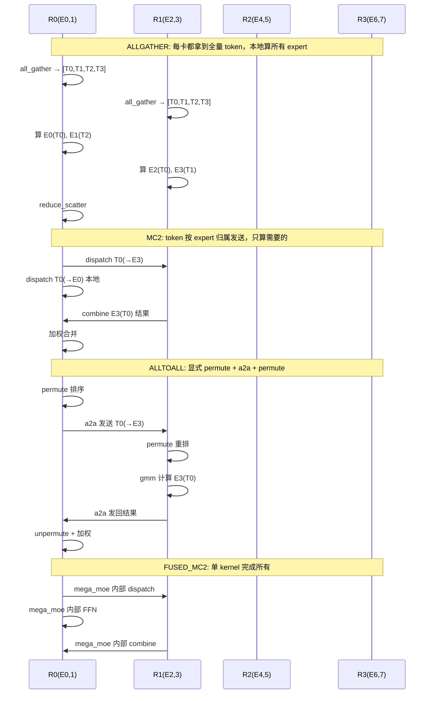

---

### 数据形状变化总结

假设 `num_tokens=4, hidden=512, intermediate=2048, topk=2, EP=4`：

| 阶段 | ALLGATHER | MC2 | ALLTOALL | FUSED_MC2 |
|------|-----------|-----|----------|-----------|
| 输入 | [4, 512] | [4, 512] | [4, 512] | [4, 512] |
| 通信后 | [4, 512] (AG) | [2, 512] (dispatch) | [2, 512] (a2a) | - |
| FFN 输入 | [2, 512] | [2, 512] | [2, 512] | - |
| gate_up 后 | [2, 4096] | [2, 4096] | [2, 4096] | - |
| SiLU 后 | [2, 2048] | [2, 2048] | [2, 2048] | - |
| down 后 | [2, 512] | [2, 512] | [2, 512] | - |
| 合并后 | [4, 512] (RS) | [4, 512] (combine) | [4, 512] (a2a+unpermute) | [4, 512] |
| 通信量 | 3×512×dtype | 2×512×dtype | 2×2×512×dtype | 0 (内部) |

---

## 总览

| 类型 | 枚举值 | 通信模式 | 融合程度 | 适用场景 |
|------|--------|---------|---------|---------|
| ALLGATHER | `MoECommType.ALLGATHER` | All-Gather + Reduce-Scatter | 无融合 | 无 EP 或 EP 较小 |
| MC2 | `MoECommType.MC2` | 硬件 dispatch/combine 算子 | 通信计算重叠 | Decode 小 batch（≤512 tokens/rank） |
| ALLTOALL | `MoECommType.ALLTOALL` | 显式 All-to-All | 无融合 | token 数较多或 EP 较小 |
| FUSED_MC2 | `MoECommType.FUSED_MC2` | 融合单 kernel | 完全融合 | Prefill 大 batch |

## 选择逻辑

选择逻辑在 `select_moe_comm_method()`（`ascend_forward_context.py`）中实现。A2 设备的决策树（`_select_a2_moe_comm_method`）如下：

```
是 prefill 且 enable_fused_mc2=1？
  └─ 是 → FUSED_MC2

每设备 expert 数 ≤ 24 且 EP 并行度 ≥ 16 且 token 数 ≤ mc2_capacity？
  └─ 是 → MC2

其他情况 → ALLTOALL
```

关键约束：
- `mc2_tokens_capacity` = 512 tokens/rank（通过 `set_mc2_tokens_capacity` 可配置）
- 若 `enable_expert_parallel=False` 或 EP 大小 = 1 → **ALLGATHER**
- 若 LoRA + EP 同时启用 → **ALLTOALL**（MC2/FusedMC2 与 LoRA 不兼容）

## 详细说明

### 1. ALLGATHER（`AllGatherCommImpl`）

**文件位置**：`moe_comm_method.py:199`、`token_dispatcher.py:356`、`prepare_finalize.py:326`

**流水线**：`DP AG → MoE → DP RS`

| 阶段 | 核函数 |
|------|--------|
| Prepare | `npu_dynamic_quant`（可选）+ `maybe_all_gather_and_maybe_unpad` |
| Token Dispatch | `npu_moe_init_routing`（按 expert 排序本地 token） |
| MLP | `npu_grouped_matmul`（gate_up + down，多次调用） |
| Token Combine | `npu_moe_token_unpermute`（恢复顺序 + 加权求和） |
| Finalize | `maybe_pad_and_reduce`（DP reduce-scatter） |

**特点**：
- 每个 rank 持有全量 token，本地计算，无跨 rank token 交换
- 实现最简单，适用于所有场景
- 通信开销随 DP 大小线性增长

### 2. MC2（`MC2CommImpl`）

**文件位置**：`moe_comm_method.py:229`、`token_dispatcher.py:111`、`prepare_finalize.py:233`

**流水线**：`Pad/Split → npu_moe_distribute_dispatch → MLP → npu_moe_distribute_combine → All-Gather`

| 阶段 | 核函数 |
|------|--------|
| Prepare | Pad 到 TP 对齐 + TP 切分 |
| Token Dispatch | `npu_moe_distribute_dispatch_v2` / `npu_moe_distribute_dispatch` |
| MLP | `npu_grouped_matmul`（多次调用） |
| Token Combine | `npu_moe_distribute_combine_v2` / `npu_moe_distribute_combine` |
| Finalize | TP all-gather |

**特点**：
- 使用 NPU 硬件算子，将 token 路由与通信融合
- 通信和计算重叠（算子内部流水线并行）
- token 数限制：≤512 tokens/rank（硬编码在 `_MC2_TOKENS_PER_RANK_LIMIT`）
- 需要 `mc2_mask` 标记有效 token 和填充 token

### 3. ALLTOALL（`AlltoAllCommImpl`）

**文件位置**：`moe_comm_method.py:249`、`token_dispatcher.py:455`、`prepare_finalize.py:113`

**流水线**：`Pad/Split → permute → all-to-all → permute → MLP → unpermute → all-to-all → unpermute → All-Gather`

| 阶段 | 核函数 |
|------|--------|
| Prepare | Pad 到 TP 对齐 + TP 切分 |
| Token Dispatch | `npu_moe_token_permute` → `async_all_to_all` → `npu_moe_token_permute` |
| MLP | `npu_grouped_matmul`（多次调用） |
| Token Combine | `npu_moe_token_unpermute` → `async_all_to_all` → `npu_moe_token_unpermute` |
| Finalize | TP all-gather |

**特点**：
- 显式 all-to-all 通信，permute/unpermute 步骤分离
- 无 token 数限制，适用于任意 batch 大小
- 最通用的实现，当 MC2/FusedMC2 约束不满足时作为兜底
- 两轮 all-to-all（dispatch + combine）

### 4. FUSED_MC2（`FusedMC2CommImpl`）

**文件位置**：`moe_comm_method.py:273`

**流水线**：`Pad/Split → mega_moe / dispatch_ffn_combine → All-Gather`

| 阶段 | 核函数 |
|------|--------|
| Prepare | Pad 到 TP 对齐 + TP 切分 |
| fused_experts | `cann_ops_transformer.mega_moe` 或 `torch.ops._C_ascend.dispatch_ffn_combine` |
| Token Combine | *无*（已融合到上述算子中） |
| Finalize | TP all-gather |

**特点**：
- **完全绕过 `token_dispatcher`** —— dispatch + MLP + combine 融合为一个 kernel
- 大 batch 下延迟最低、吞吐最高
- 约束条件：
  - `hidden_size` 必须在 [1024, 8192] 范围内且为 512 的倍数
  - EP 大小 ≤ 64（mega_moe）或 ≤ 32（dispatch_ffn_combine）
  - 仅支持量化类型：`w8a8`、`w4a8`、`w8a8_dynamic`、`w4a8_dynamic`
- 两种后端选项：
  - `mega_moe`：CANN 算子，需要分配 sym buffer
  - `dispatch_ffn_combine`：Ascend 自定义算子，mega_moe 不可用时的兜底

## 架构图与调用关系

### 类继承关系

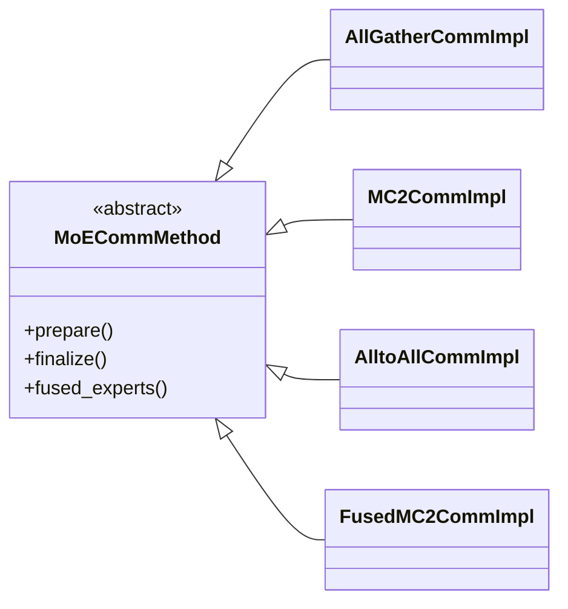

### 顶层调用流程

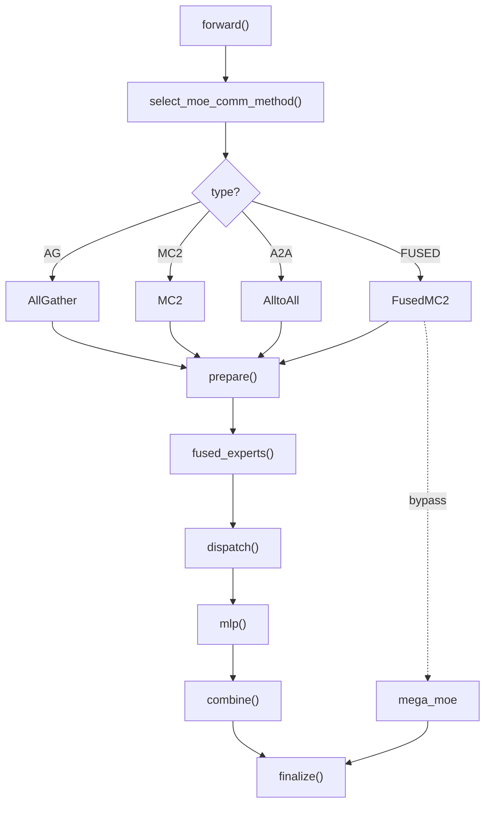

### 选择逻辑（A2 设备）

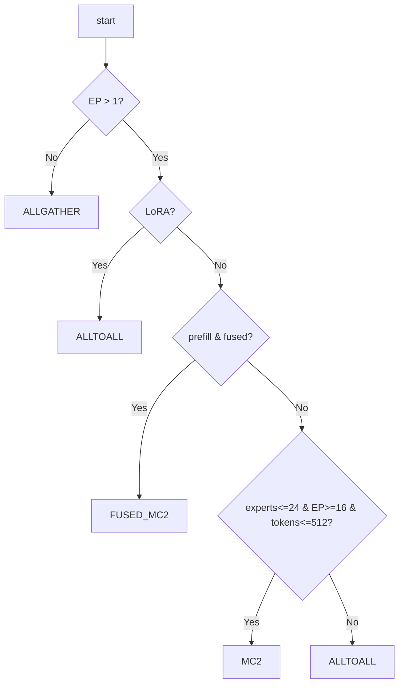

### 选择逻辑（A3 设备）

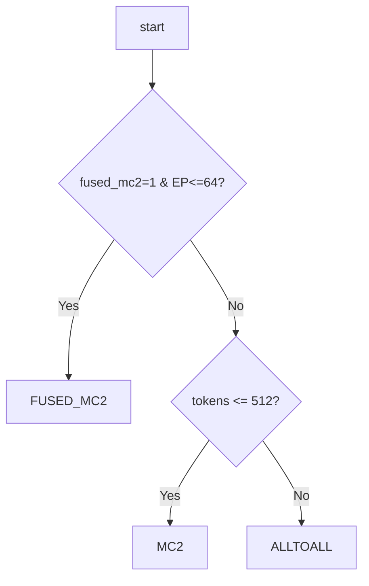

### 选择逻辑（A5 设备）

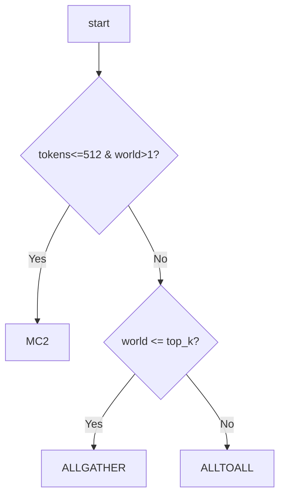

## 流水线图

### ALLGATHER 流水线

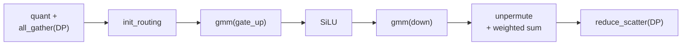

### MC2 流水线

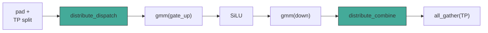

### ALLTOALL 流水线

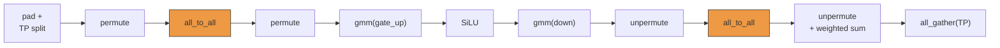

### FUSED_MC2 流水线

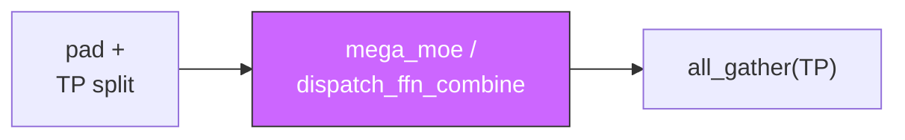

## 跨 Rank 数据流

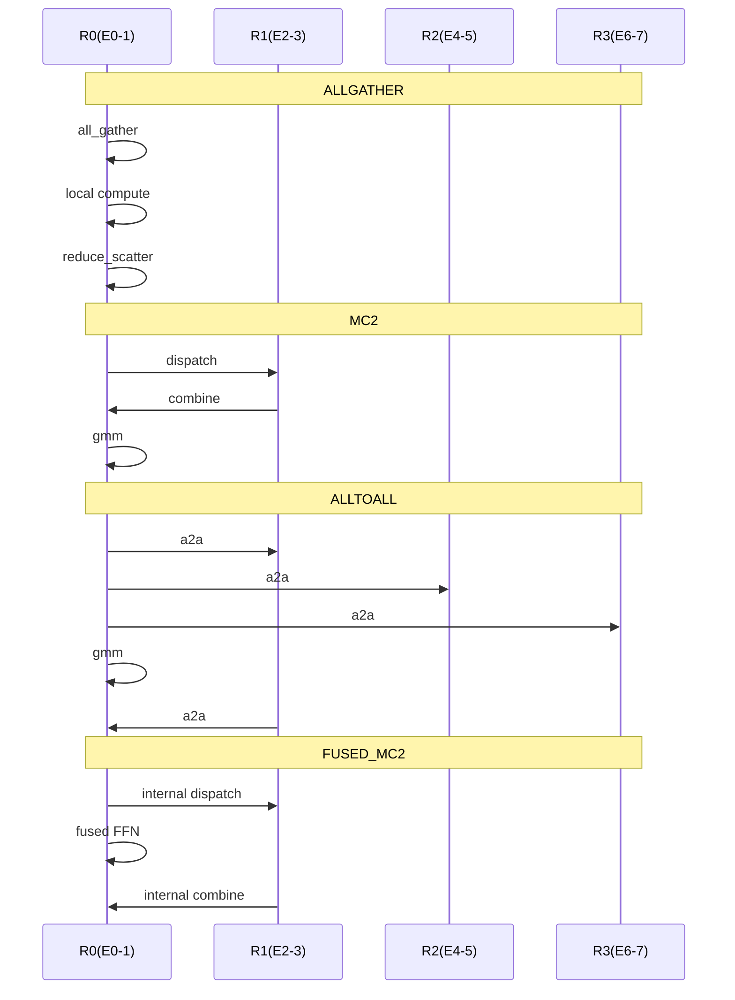

## 关键代码

### 选择逻辑入口

```python
# ascend_forward_context.py:351
def select_moe_comm_method(num_tokens, vllm_config, attn_metadata=None, in_profile_run=False):
    mc2_tokens_capacity = get_mc2_tokens_capacity()
    soc_version = get_ascend_device_type()

    if not vllm_config.parallel_config.enable_expert_parallel or get_ep_group().world_size == 1:
        moe_comm_type = MoECommType.ALLGATHER
    elif lora_config is not None and vllm_config.parallel_config.enable_expert_parallel:
        moe_comm_type = MoECommType.ALLTOALL
    elif soc_version == AscendDeviceType.A2:
        moe_comm_type = _select_a2_moe_comm_method(...)
    elif soc_version == AscendDeviceType.A3:
        moe_comm_type = _select_a3_moe_comm_method(...)
    elif soc_version == AscendDeviceType.A5:
        moe_comm_type = _select_a5_moe_comm_method(...)
    elif soc_version == AscendDeviceType._310P:
        moe_comm_type = MoECommType.ALLGATHER
```

### A2 设备选择逻辑

```python
# ascend_forward_context.py:291
def _select_a2_moe_comm_method(num_tokens, vllm_config, mc2_tokens_capacity, attn_metadata=None, in_profile_run=False):
    num_experts = vllm_config.model_config.get_num_experts()
    ep_world_size = vllm_config.parallel_config.world_size_across_dp // vllm_config.parallel_config.pipeline_parallel_size
    num_experts_per_device = num_experts // ep_world_size
    is_prefill = attn_metadata is not None and getattr(attn_metadata, "num_prefills", 0) > 0

    if (is_prefill or in_profile_run) and get_ascend_config().enable_fused_mc2 == 1:
        return MoECommType.FUSED_MC2          # 分支 1：融合 kernel

    if num_experts_per_device <= 24 and ep_world_size >= 16 and num_tokens <= mc2_tokens_capacity:
        return MoECommType.MC2                # 分支 2：硬件 dispatch/combine

    return MoECommType.ALLTOALL               # 分支 3：兜底 all-to-all
```

### 基类 fused_experts 核心流程

```python
# moe_comm_method.py:133
class MoECommMethod(ABC):
    def fused_experts(self, fused_experts_input):
        # 1. Token Dispatch：按 expert 分发 token
        token_dispatch_output = self.token_dispatcher.token_dispatch(token_dispatch_input)

        # 2. MLP 计算：每个 expert 执行 gate_up → SiLU → down
        mlp_output, _ = self._apply_mlp(mlp_compute_input)

        # 3. Token Combine：加权合并 expert 输出
        routed_out = self.token_dispatcher.token_combine(
            hidden_states=mlp_output,
            combine_metadata=token_dispatch_output.combine_metadata,
        )
```

### ALLGATHER — Token Dispatch

```python
# token_dispatcher.py:415 (TokenDispatcherWithAllGather.token_dispatch)
# 核心：npu_moe_init_routing 按 expert 排序本地 token
sorted_hidden_states, expanded_row_idx, expert_tokens, dynamic_scale = DeviceOperator.npu_moe_init_routing(
    hidden_states,
    topk_ids,
    scale=dynamic_scale,
    active_num=num_tokens * self.top_k,
    expert_num=global_num_experts,
    expert_tokens_num_type=1,
    expert_tokens_num_flag=True,
    active_expert_range=[first_expert_idx, last_expert_idx],
    quant_mode=quant_mode,
    act_quant_type=act_quant_type,
)
```

### ALLGATHER — Token Combine

```python
# token_dispatcher.py:442 (TokenDispatcherWithAllGather.token_combine)
# 核心：npu_moe_token_unpermute 恢复顺序 + 加权求和
final_hidden_states = DeviceOperator.npu_moe_token_unpermute(
    permuted_tokens=hidden_states,
    sorted_indices=combine_metadata.expanded_row_idx,
    probs=combine_metadata.topk_weights,
)
```

### MC2 — Token Dispatch

```python
# token_dispatcher.py:243 (TokenDispatcherWithMC2.token_dispatch)
# 核心：npu_moe_distribute_dispatch 硬件融合路由 + 通信
output = (
    torch_npu.npu_moe_distribute_dispatch_v2(**kwargs_mc2)
    if self.enable_dispatch_v2
    else torch_npu.npu_moe_distribute_dispatch(**kwargs_mc2)
)
(expand_x, dynamic_scale, assist_info_for_combine,
 expert_token_nums, ep_recv_counts, tp_recv_counts, expand_scales) = output[0:7]
```

### MC2 — Token Combine

```python
# token_dispatcher.py:346 (TokenDispatcherWithMC2.token_combine)
# 核心：npu_moe_distribute_combine 硬件融合通信 + 加权求和
combined_output = (
    torch_npu.npu_moe_distribute_combine_v2(**kwargs_mc2)
    if self.enable_dispatch_v2
    else torch_npu.npu_moe_distribute_combine(**kwargs_mc2)
)
```

### ALLTOALL — Token Dispatch

```python
# token_dispatcher.py:488 (TokenDispatcherWithAll2AllV.token_dispatch)
# 1. 预处理：按 topk_ids 本地排序
permutated_local_input_tokens, reversed_local_input_permutation_mapping = torch_npu.npu_moe_token_permute(
    tokens=hidden_states,
    indices=topk_ids,
    num_out_tokens=num_out_tokens,
)

# 2. All-to-All 通信：发送 token 到对应 EP rank
_, global_input_tokens, permute1_ep_all_to_all_handle = async_all_to_all(
    permutated_local_input_tokens, output_splits, input_splits, self.ep_group
)
permute1_ep_all_to_all_handle.wait()

# 3. 后处理：按本地 expert 索引重排
global_input_tokens, _, reversed_global_input_permutation_mapping = torch_npu.npu_moe_token_permute(
    global_input_tokens, global_input_tokens_local_experts_indices
)
```

### ALLTOALL — _preprocess 计算 splits

```python
# token_dispatcher.py:621 (TokenDispatcherWithAll2AllV._preprocess)
# 统计每个 expert 的 token 数，计算 all-to-all 的 split 信息
num_local_tokens_per_expert = torch.histc(topk_ids, bins=self.num_experts, min=0, max=self.num_experts)

# input_splits: 本 rank 发给每个 EP rank 的 token 数
input_splits = (
    num_local_tokens_per_expert.reshape(ep_size, self.num_local_experts)
    .sum(axis=1).to("cpu").numpy()
)

# output_splits: 本 rank 从每个 EP rank 接收的 token 数
num_global_tokens_per_expert = gather_from_sequence_parallel_region(
    num_local_tokens_per_expert, group=self.ep_group
).reshape(ep_size, self.num_experts)
output_splits = (
    num_global_tokens_per_local_expert.sum(axis=-1).to("cpu").numpy()
)
```

### ALLTOALL — async_all_to_all

```python
# comm_utils.py:35
def async_all_to_all(input_, output_split_sizes, input_split_sizes, group, event=None):
    a2a_out = input_.new_empty(
        size=[sum(output_split_sizes)] + list(input_.size()[1:]),
        dtype=input_.dtype, device=torch.npu.current_device(),
    )
    # 使用独立通信流，实现通信与计算重叠
    handle = dist.all_to_all_single(
        a2a_out, input_,
        output_split_sizes=output_split_sizes,
        input_split_sizes=input_split_sizes,
        group=group, async_op=True,
    )
    return event, a2a_out, handle
```

### ALLTOALL — Token Combine

```python
# token_dispatcher.py:564 (TokenDispatcherWithAll2AllV.token_combine)
# 1. 撤销 local permutation
hidden_states = torch_npu.npu_moe_token_unpermute(hidden_states, rev_global)

# 2. 反向 All-to-All：结果发回原始 rank
_, permutated_local_input_tokens, handle = async_all_to_all(
    hidden_states,
    combine_metadata.input_splits,    # 注意：splits 互换
    combine_metadata.output_splits,
    self.ep_group,
)
handle.wait()

# 3. 恢复顺序 + 加权求和
output = torch_npu.npu_moe_token_unpermute(
    permuted_tokens=permutated_local_input_tokens,
    sorted_indices=combine_metadata.reversed_local_input_permutation_mapping,
    probs=combine_metadata.topk_weights,
    restore_shape=combine_metadata.hidden_shape_before_permute,
)
```

### FUSED_MC2 — 融合 kernel（绕过 dispatcher）

```python
# moe_comm_method.py:435 (FusedMC2CommImpl.fused_experts)
# 完全绕过 token_dispatcher，直接调用融合算子
if _MEGA_MOE_SUPPORTED:
    # 后端 1：CANN mega_moe 算子
    out, expert_tokens = self._apply_cann_mega_moe(fused_experts_input, topk_ids)
else:
    # 后端 2：dispatch_ffn_combine 算子
    out = torch.empty_like(fused_experts_input.hidden_states)
    torch.ops._C_ascend.dispatch_ffn_combine(
        x=fused_experts_input.hidden_states,
        weight1=fused_experts_input.weights.w1,
        weight2=fused_experts_input.weights.w2,
        expert_idx=topk_ids,
        scale1=fused_experts_input.weights.w1_scale,
        scale2=fused_experts_input.weights.w2_scale,
        bias1=fused_experts_input.weights.w1_scale_bias,
        bias2=fused_experts_input.weights.w2_scale_bias,
        probs=fused_experts_input.topk_weights.to(torch.float32),
        group=self.token_dispatcher.moe_all_to_all_group_name,
        max_output_size=get_ascend_config().mega_moe_max_tokens,
        swiglu_limit=fused_experts_input.swiglu_limit,
        x_active_mask=fused_experts_input.routing.mc2_mask,
        out=out,
        expert_token_nums=self.expert_token_nums,
    )
```

### Prepare/Finalize（All2All 路径）

```python
# prepare_finalize.py:129 (PrepareAndFinalizeWithAll2All.prepare)
def prepare(self, hidden_states, router_logits, ...):
    # 1. Pad 到 TP size 的整数倍
    pad_size = self.tp_size - self.num_tokens
    if pad_size > 0:
        hidden_states = nn.functional.pad(hidden_states, (0, 0, 0, pad_size))
        router_logits = nn.functional.pad(router_logits, (0, 0, 0, pad_size))

    # 2. TP 切分：取当前 rank 的那片
    if self.tp_size > 1:
        split_hidden_states = torch.tensor_split(hidden_states, self.tp_size, dim=0)
        hidden_states = split_hidden_states[self.tp_rank]

# prepare_finalize.py:198 (PrepareAndFinalizeWithAll2All.finalize)
def finalize(self, hidden_states, reduce_results, ...):
    # 1. TP all-gather：拼回所有分片
    if self.tp_size > 1:
        gathered = torch.empty(padded_shape, device=hidden_states.device)
        splits = torch.tensor_split(gathered, self.tp_size, dim=0)
        dist.all_gather(list(splits), hidden_states, self.moe_config.tp_group.device_group)
        hidden_states = gathered
    # 2. 截断 padding
    if self.num_tokens < hidden_states.shape[0]:
        hidden_states = hidden_states[:self.num_tokens]
```

## 核函数汇总表

| 核函数 | ALLGATHER | MC2 | ALLTOALL | FUSED_MC2 |
|--------|-----------|-----|----------|-----------|
| `npu_dynamic_quant` | Prepare 阶段 | - | Dispatch 阶段（可选） | - |
| `npu_moe_init_routing` | Dispatch 阶段 | - | - | - |
| `npu_moe_token_permute` | - | - | Dispatch + Combine 阶段 | - |
| `npu_moe_token_unpermute` | Combine 阶段 | - | Dispatch + Combine 阶段 | - |
| `npu_moe_distribute_dispatch` | - | Dispatch 阶段 | - | - |
| `npu_moe_distribute_combine` | - | Combine 阶段 | - | - |
| `async_all_to_all` | - | - | Dispatch + Combine 阶段 | - |
| `npu_grouped_matmul` | MLP 阶段 | MLP 阶段 | MLP 阶段 | - |
| `mega_moe` | - | - | - | fused_experts 阶段 |
| `dispatch_ffn_combine` | - | - | - | fused_experts 阶段 |

## 目录结构

```
vllm_ascend/ops/fused_moe/
├── moe_comm_method.py      # MoECommMethod 基类 + 4 种通信实现
├── token_dispatcher.py     # 各通信方式的 token dispatch/combine 逻辑
├── prepare_finalize.py     # 各通信方式的 prepare/finalize 张量处理
├── moe_mlp.py              # MLP 计算（grouped matmul 变体）
├── moe_runtime_args.py     # 阶段间数据传递的数据类
├── fused_moe.py            # 顶层 FusedMoE 层集成
├── comm_utils.py           # All-to-All 辅助函数、CANN 算子加载
├── gate_linear.py          # Router/gate 线性投影
├── experts_selector.py     # Expert 选择与路由逻辑
└── moe_stage_contracts.py  # 阶段接口契约
```

---

## 四种方式详细对比

| 维度 | ALLGATHER | MC2 | ALLTOALL | FUSED_MC2 |
|------|-----------|-----|----------|-----------|
| **通信次数** | 1 次 all_gather + 1 次 reduce_scatter | 1 次 dispatch + 1 次 combine | 2 次 all_to_all × 2 轮 | 0 次（内部融合） |
| **计算冗余** | 有（每卡计算所有 expert） | 无 | 无 | 无 |
| **Token 数限制** | 无 | ≤512/rank | 无 | 取决于后端 |
| **EP 大小限制** | 无 | 建议 ≥16 | 无 | ≤64 (mega_moe) / ≤32 (dispatch_ffn_combine) |
| **Hidden Size 限制** | 无 | 无 | 无 | [1024, 8192] 且为 512 倍数 |
| **LoRA 支持** | 支持 | 不支持 | 支持 | 不支持 |
| **量化支持** | 全部 | 部分 | 全部 | w8a8/w4a8/w8a8_dynamic/w4a8_dynamic |
| **通信计算重叠** | 否 | 是 | 否 | 是（完全融合） |
| **Kernel 启动次数** | 多 | 中 | 多 | 少（1-2 次） |
| **最佳场景** | 无 EP 或 EP=1 | Decode 小 batch | 大 batch 或 EP 小 | Prefill 大 batch |

### 性能特征对比

```
延迟（单 token）:  FUSED_MC2 < MC2 < ALLTOALL < ALLGATHER
吞吐（大 batch）:  FUSED_MC2 > ALLTOALL > MC2 > ALLGATHER
显存占用:          ALLGATHER > ALLTOALL > MC2 > FUSED_MC2
通用性:            ALLTOALL > ALLGATHER > MC2 > FUSED_MC2
```

### 选择决策速查

```
你的场景是什么？
│
├─ 无 EP 或 EP=1
│   └─→ ALLGATHER
│
├─ LoRA + EP
│   └─→ ALLTOALL
│
├─ Prefill 阶段 + 开启 fused_mc2
│   └─→ FUSED_MC2
│
├─ Decode 阶段 + token ≤ 512 + EP ≥ 16
│   └─→ MC2
│
└─ 其他情况
    └─→ ALLTOALL
```

---

## 常见问题（FAQ）

### Q1: 为什么 MC2 有 token 数限制？

**A**: MC2 使用 `npu_moe_distribute_dispatch` 硬件算子，该算子内部使用固定大小的缓冲区。超过 512 tokens/rank 时，缓冲区不足会导致错误或性能下降。

### Q2: 为什么 LoRA 不能用 MC2/FUSED_MC2？

**A**: MC2/FUSED_MC2 的 dispatch/combine 是单个 C++ 算子，无法被 Python 层的 LoRA 逻辑 patch。ALLTOALL 使用显式的 permute + all_to_all，LoRA 可以介入修改 indices。

### Q3: FUSED_MC2 的两个后端（mega_moe 和 dispatch_ffn_combine）有什么区别？

**A**:
- `mega_moe`：CANN 官方算子，支持更大 EP（≤64），需要预分配 sym buffer
- `dispatch_ffn_combine`：Ascend 自定义算子，EP 限制更小（≤32），但某些场景更快

选择逻辑：优先 mega_moe，不可用时 fallback 到 dispatch_ffn_combine。

### Q4: ALLGATHER 为什么有计算冗余还要用？

**A**: 当 EP=1（无专家并行）时，所有 expert 都在本地，无需跨卡通信。此时 ALLGATHER 是最简单高效的实现。

### Q5: 如何判断当前使用的是哪种通信方式？

**A**: 查看日志中的 `MoE comm method selected` 输出：
```
MoE comm method selected: soc=A5, method=MoECommType.MC2, num_tokens=128, mc2_capacity=512
```

### Q6: 为什么 ALLTOALL 需要两轮 all_to_all？

**A**: 
- 第一轮（dispatch）：将 token 按 expert 归属发送到对应 EP rank
- 第二轮（combine）：将 expert 计算结果发回原始 rank

这是 EP 的标准实现，MC2 通过硬件算子将两轮融合为一次通信。

### Q7: 如何调优 MoE 通信性能？

**A**:
1. **Decode 场景**：确保 token 数 ≤ 512，让系统选择 MC2
2. **Prefill 场景**：开启 `enable_fused_mc2=1`，使用 FUSED_MC2
3. **大 batch 场景**：如果超过 MC2 容量，系统自动选择 ALLTOALL
4. **EP 大小**：EP ≥ 16 时更容易触发 MC2，性能更好

### Q8: 310P 设备为什么只能用 ALLGATHER？

**A**: 310P 是较老的昇腾设备，不支持 `npu_moe_distribute_dispatch` 等高级算子，只能使用最通用的 ALLGATHER 实现。

---

## 调试技巧

### 查看当前通信方式

```python
from vllm_ascend.ascend_forward_context import _EXTRA_CTX
moe_comm_type = _EXTRA_CTX.moe_comm_type
print(f"Current MoE comm type: {moe_comm_type}")
```

### 强制指定通信方式（调试用）

修改 `ascend_forward_context.py` 中的 `select_moe_comm_method`，直接返回指定类型：

```python
def select_moe_comm_method(...):
    return MoECommType.ALLTOALL  # 强制使用 ALLTOALL
```

### 性能分析

使用 NPU profiling 工具查看各 kernel 耗时：

```bash
# 启用 profiling
export ASCEND_GLOBAL_LOG_LEVEL=1
export PROFILING_MODE=true

# 运行推理后查看结果
msprof --analyze=summary
```

---

## 相关文档

- [vLLM Ascend 官方文档](https://docs.vllm.ai/projects/ascend/en/latest/)
- [MoE 论文：Outrageously Large Neural Networks](https://arxiv.org/abs/1602.07654)
- [昇腾 NPU 编程指南](https://www.hiascend.com/document)
